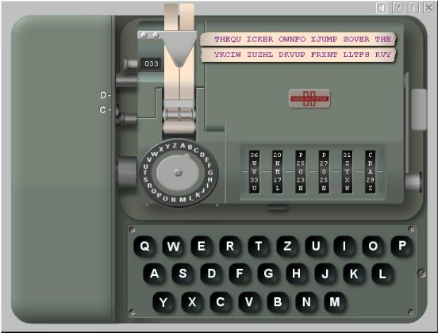



## Hagelin BC\-52 Crypto Machine

### Description

The new Hagelin BC-52 Cipher Machine is out! After the Award Winning Enigma, M-209 and Atomix simulators this is the fourth software cipher machine that makes you feel like a real cryptologist. After the success of the C-38 and M-209 as tactical cipher devices Hagelin Cryptos (Crypto AG) developed a cipher machine for high level military and diplomatic encryption. In 1952 the C-52 was introduced which caused ripples throughout the cryptanalytic community. The C-52 raised the security of drum-and-lug devices to another level. The machine had 6 irregular moving pinwheels, selected from a set of 12, and the number of drum bars was extended to 32, of which 5 where also used to advance the wheels. When lugs and pins are selected carefully the C-52 provides even in this computer era a powerful encryption. The combination of C-52 and the keyboard, denoted B-52, was named BC-52. Within short time the BC-52 was purchased by more than 60 countries and remained popular until today. This program is an accurate simulation of the Hagelin BC-52. The user can select between the C-52 and CX-52 model, both with the B-52 keyboard attachment. The machine can be customized and different wheel and drum bar configurations are possible. This sim enables you to encipher and decipher messages and apply the key settings as you would with an actual machine. The sim has a great 'look' and 'feel' with detailed GUI. There's also a Formatted Clipboard and Autotyping Function. The program has a very complete helpfile, containing the manual, the enciphering procedures and all technical details on the machine. Complete program, ready to use! All comments and feedback most welcome and...if you like it, vote it! Freeware download also available at http://users.telenet.be/d.rijmenants
 
### More Info
 

             |
---                |---
**Submitted On**   |2006-09-30 14:02:28
**By**             |[D\. Rijmenants](https://github.com/Planet-Source-Code/PSCIndex/blob/master/ByAuthor/d-rijmenants.md)
**Level**          |Advanced
**User Rating**    |5.0 (75 globes from 15 users)
**Compatibility**  |VB 5\.0, VB 6\.0
**Category**       |[Encryption](https://github.com/Planet-Source-Code/PSCIndex/blob/master/ByCategory/encryption__1-48.md)
**World**          |[Visual Basic](https://github.com/Planet-Source-Code/PSCIndex/blob/master/ByWorld/visual-basic.md)
**Archive File**   |[Hagelin\_BC20243910112006\.zip](https://github.com/Planet-Source-Code/d-rijmenants-hagelin-bc-52-crypto-machine__1-66757/archive/master.zip)

